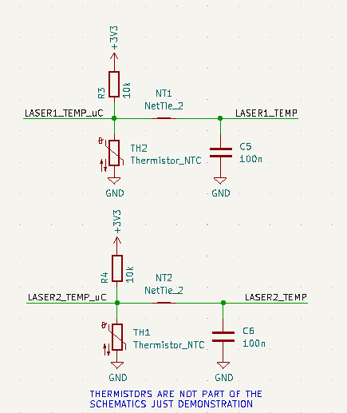

# Issues with the Project

# Revision1

## Wrong ADC

The ADC2 unit can't be used when the device using WiFi.

# Revision2 

## Laser Module

### Temperature measurement 

Temperature measurement doesn't work because the NTC ground is connected to 5V because of the EDFA module.

